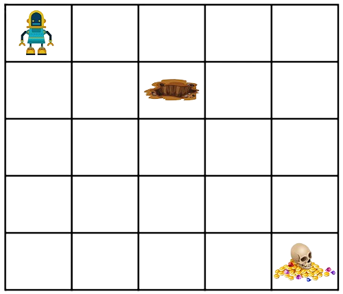
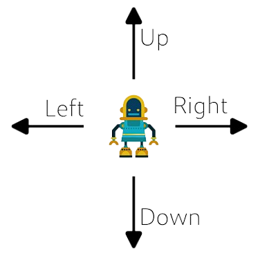
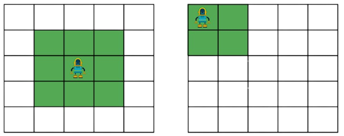

# Pirate Robot Reinforcement Learning

Este projeto foi desenvolvido como parte da disciplina de Redes Neurais Profundas do Programa de Pós Graduação em Engenharia Elétrica e de Computação (PPGEEC) da Universidade Federal de Goiás (UFG). O objetivo do trabalho é implementar um ambiente de aprendizado por reforço onde um robô pirata está em busca de um tesouro perdido. O robô deve ser treinado para encontrar o tesouro utilizando os algoritmos SARSA e REINFORCE, com redes neurais.

## Descrição do Trabalho

O ambiente é representado por uma grade, onde cada célula dessa grade representa um espaço onde pode ser encontrado o agente (robô) ou elementos do ambiente, como buracos ou o tesouro. O robô sempre começa no canto superior esquerdo e o tesouro está localizado no canto inferior direito.

Para gerar diferentes situações, cada execução da simulação gera a posição aleatória de um buraco. O robô não pode sair para fora da grade nem ir para um espaço onde se encontra um buraco. Se alguma dessas situações ocorrer, o episódio é encerrado. O agente robô consegue realizar 4 ações categóricas: Direita, Esquerda, Para cima e Para baixo.

O robô não possui uma observação completa do sistema, sua observação é parcial. Ele possui informações sobre a sua vizinhança imediata (células ao redor), indicando se há espaço fora da grade, buracos ou o tesouro.

### Ambiente em Grade do Robô Pirata



*Figura 1: Ambiente em grade do robô pirata em busca do tesouro.*

### Ações Realizadas pelo Robô



*Figura 2: Ações realizadas pelo agente robô.*

### Exemplo do Estado do Ambiente do Robô Pirata



*Figura 3: Exemplo do estado do ambiente do robô pirata. (a) robô se encontra centralizado e tem as informações dos estados ao seu redor (em verde). (b) robô se encontra no canto e possui as informações dos estados em verde.*

### Desafios Extras Implementados

Além do desafio principal, foram implementados os seguintes desafios extras:

- Aleatorização da inicialização do tesouro.
- Aumento da quantidade de buracos aleatórios.
- Aumento do campo de visualização do robô.
- Aumento do tamanho da grade.

## Estrutura do Projeto

```
rnp-trabalho-3/
│
├── agents/
│   ├── sarsa.py            # Implementação do algoritmo SARSA
│   └── reinforce.py        # Implementação do algoritmo REINFORCE
├── assets/
│   └── images              # Diretório com imagens
├── environment/
│   └── env.py              # Implementação do ambiente do robô pirata
├── interface/
│   └── gui.py              # Implementação da interface gráfica
├── results/
│   ├── logs/               # Diretório para armazenar logs de treinamento
│   ├── models/             # Diretório para armazenar modelos treinados
│   └── plots/              # Diretório para armazenar gráficos
├── utils/
│   ├── logging.py          # Funções para salvar os resultados
│   ├── plotting.py         # Funções para plotar gráficos
│   └── saving.py           # Funções para salvar os modelos
├── venv/                   # Ambiente virtual
├── .gitignore              # Arquivo para ignorar arquivos desnecessários no git
├── constants.py            # Configurações do ambiente
├── main.py                 # Script principal para execução do treinamento
├── readme.md               # Descrição do projeto
└── requirements.txt        # Dependências do projeto
```

## Configuração do Projeto

### 1. Criação do Ambiente Virtual

Crie um ambiente virtual e instale as dependências listadas em `requirements.txt`:

```sh
python -m venv venv
venv\Scripts\activate # no Linux: source venv/bin/activate
pip install -r requirements.txt
```

### 2. Definição das Constantes

Edite o arquivo `constants.py` para definir as configurações do ambiente.

### 3. Execução do Treinamento e Interface

Execute o script principal para iniciar o treinamento dos algoritmos:

```sh
python main.py
```

## Resultados

Os resultados do treinamento serão armazenados no diretório `results/` e incluirão gráficos e logs de desempenho.

### Exemplos de Gráficos


*Retorno Médio dos Episódios vs. Épocas de Treinamento*


*Quantidade de Passos Médios vs. Épocas de Treinamento*
